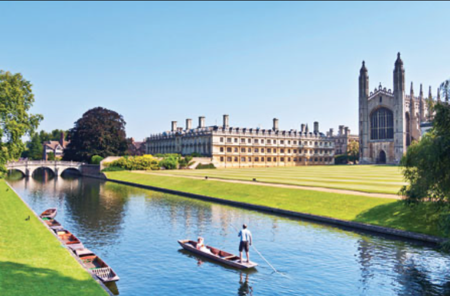

# Название
«5»

## Сложность:
25

## Условие
> Он стоял у истоков. Это была самая мощная разведовательная группа. Как его звали?
> 

## Ответ
`Арнольд_Дэйч`

## Решение
> Картинка изображает колледж в Кембридже. В названии упомянается 5. В задании говорится про разведчиков. Соединив все вместе, выходим на Кембриджскую пятёрку. Её основателем и был **Арнольд Дейч** (https://ru.wikipedia.org/wiki/Кембриджская_пятёрка)
