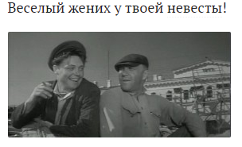

# Название: 
Герой

# Сложность: 
100

# Условие
Известному советскому и российскому актёру не давалась роль в фильме, кадр и цитату которого вы видите на картинке, до того, пока он не прочитал в журнале статью про известного партизана. Про какого партизана была статья.

# Ответ
Кирилл_Орловский 

# Решение
находим фильм - "Председатель". Читаем про этот фильм на википедии https://ru.wikipedia.org/wiki/%D0%9F%D1%80%D0%B5%D0%B4%D1%81%D0%B5%D0%B4%D0%B0%D1%82%D0%B5%D0%BB%D1%8C_(%D1%84%D0%B8%D0%BB%D1%8C%D0%BC)#%D0%92_%D1%80%D0%BE%D0%BB%D1%8F%D1%85 и находим ответ.
