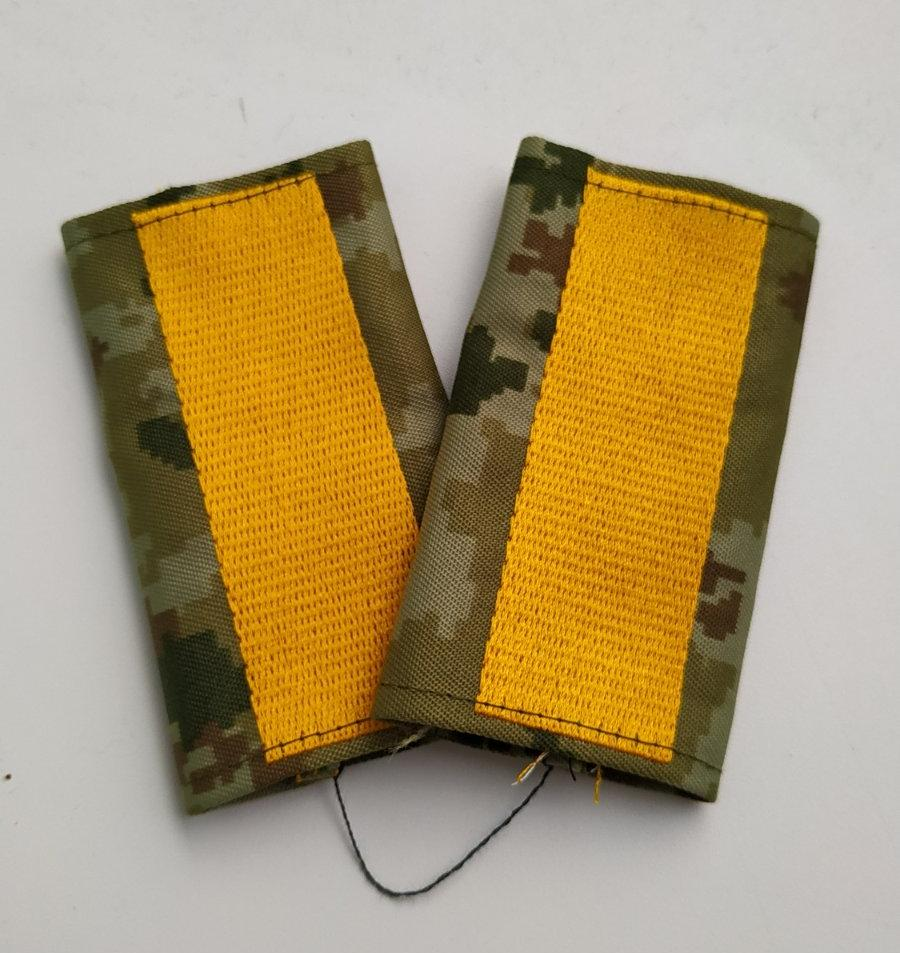

## Название: 
Исток

## Сложность: 
100

# Условие

Не всегда хорошо, когда утекает важная информация. Кто был источником советской разведки? Эта картинка вам поможет найти его псевдоним. Ответ - полное имя с нижним подчеркиванием между словами 

# Ответ

Хайнц_Харро_Макс_Вильгельм_Георг_Шульце_Бойзен
Хайнц-Харро-Макс-Вильгельм-Георг-Шульце-Бойзен

# Решение

Понимаем, что на картинке фото погон. Находим воинское звание - "Старшина", оно же псевдоним. По нему находим полное имя
