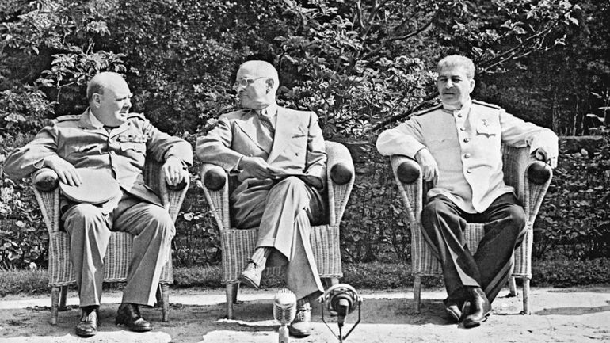

#  Название
«Кембриджская пятерка» 
## Сложность: 
100
## Условие
> Мы всё знали раньше вашего президента. Истинная цель ваших «трубчатых сплавов» (поправьте меня, если мой перевод с английского неточен) ужасает. Кто знал, что Лирик сможет открыть тайну такого мощного и самого страшного оружия. А кто этот герой? 

## Ответ
Дональд_Маклин 
## Решение
> Сделав поиск по картинке, находим, что это Потсдамская  конференция.
> Из условия следует, что мы знали о каком – то оружии раньше президента. Сделаем поиск по странице о Потсдамской конференции в вики
> И понимаем, что речь про атомное оружие, что тоже соответствует действительности. 
> Что за «трубчатые сплавы»? Переведя это словосочетание и выполнив примитивный запрос «атомная бомба tubular alloys», получаем первую же ссылку на “Tube Alloys”. Если почитать подробнее, то это стопроцентно то, что нас интересует. 
> Теперь задача найти Лирика, который первый рассказал об истинной цели “Tube alloys”. Обратим внимание на название. При поиске «Кембриджская пятерка» находим 5 агентов. Далее мы должны найти того, который предоставил информацию. Запрос «дональд маклейн tube alloys» даёт нам нужный ответ (https://rg.ru/2017/07/26/kak-razvedchik-don-maklejn-vyderzhal-vse-ispytaniia-v-anglii-i-v-sssr.html)
> Удостоверимся, что мы нашли агента с нужным псевдонимом. В результате по поисковому запросу «дональд маклейн лирик» мы находим, что это действительно интересующий нас человек (https://history.wikireading.ru/128255 , https://www.liveinternet.ru/users/stewardess0202/post373607697/.
