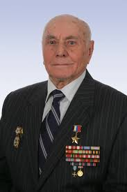

## Название: 
Полковник Торнадо

Вопрос: Кто из советских разведчиков послужил прообразом майора «Вихрь» из одноименного сериала, спасшего от разрушения польский город Краков?
Ответ: Алексей Николаевич Ботян

## Сложность: 
50

# Условие

У одного пользователя был найден файл. Сможете определить его любимый сериал? 

# Ответ
Майор_Вихрь

# Решение
По фото находим разведчика Ботяна А.Н.. Изучая его биографию видим, что он являлся прототипом майора "Вихрь" из одноименного сериала