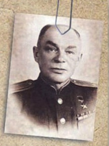

# Название: 
Спец

# Сложность: 
50

# Условие
Нужно найти фамилию и имя российского разведчика, изображенного на фото. Известно, что он возглавлял одно из самых крупных партизанских соединенний. 

# Ответ
Станислав_Ваgeroyупшасов 

# Решение
Гуглим по фото + фразу "одно из самых крупных партизанских соединений" и находим на сайте http://svr.gov.ru/history/stages/vaupshasov.htm ФИО разведчика. 
 
