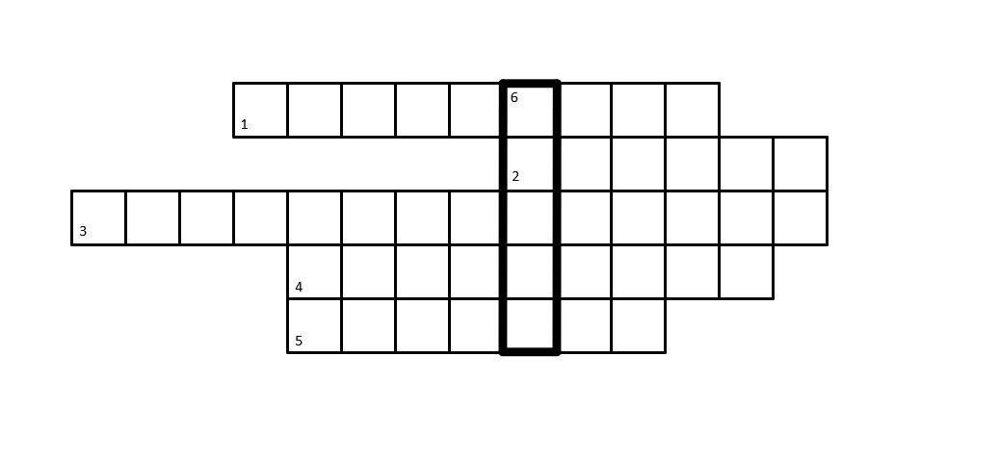

# Название: 
Молодой человек

## Описание
1. В 1946 году наш герой поступает в Академию. Какой язык он там выучил?
2. Наш герой возглавлял в этой стране нелегальную резидентуру в 1955-1961 гг.
3. Во время Великой отечественной войны 1941-1945 гг. он служил в разведывательном ... дивизионе
4. Кому пренадлежан слова: «Это был прекрасный, изумительный нелегал потрясающего таланта»? 
   (Далее речь пойдет про того, о ком эти слова)
5. Этот город в США, известен как научный центр. В нем располагается старейший кампус Калифорнийского университета. Какой химический элемент назван в честь этого города?

6. Итоговое слово заштфровано каким-то очень старым и известным шифром.

Слово под номером 6 - ответ на задание

## Ответы

1. Китайский
2. Англия
3. Артиллерийском
4. Трубников
5. Берклий
6. саинл -> применим ROT28 -> центр

## Решения:
Решать эту "матрешку" нужно с 4 части.

4.Гуглим по цитате - получаем ответ и на четвертый вопрос, и узнаем о ком была речь в первых трех вопросах

1.Изучаем бмографию Молодого К.Т., смотрим где он учился -> Академия внешней торговли, и далее находим, что он там изучил китайский язык.https://ru.wikipedia.org/wiki/%D0%9C%D0%BE%D0%BB%D0%BE%D0%B4%D1%8B%D0%B9,_%D0%9A%D0%BE%D0%BD%D0%BE%D0%BD_%D0%A2%D1%80%D0%BE%D1%84%D0%B8%D0%BC%D0%BE%D0%B2%D0%B8%D1%87

2.Изучая биографию, находим страну.

3.Ищем про разведывательный дивизион, дальше находим, что он был еще и артиллерийский https://nvo.ng.ru/spforces/2018-04-20/7_993_legend.html?auth_service_error=1&id_user=Y

5.Ищем по первому предложению задания. Находим город Беркли. Затем немного изучив его историю, выходим на химический элемент - берилий
