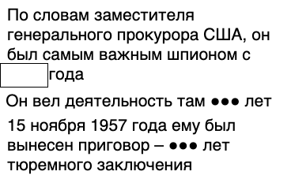

# Название
«Не тот, кто есть. Ч.4»

## Сложность:
50

## Условие
> Как и положено пойманому разведчику... - его отправили под суд. Какой срок ему вынесли? В ответе укажите цифрами количество лет.

## Ответ
`30`

## Решение
> Ищем про **приговор 15 ноября 1957**. Находим [сайт СВР про Рудольфа Абеля](http://svr.gov.ru/smi/2009/11/krzv20091114.htm) - выясняем, что приговор составил 30 лет.
