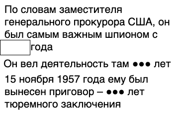

# Название
«Не тот, кто есть. Ч.5»

## Сложность:
50

## Условие
> Наверное ты уже нашел какую-то информацию о нём. Однако он совсем не тот, кто есть. Как на самом деле звали шпиона? В ответе напиши найденые Имя_Фамилия

## Ответ
`Вильям_Фишер`

## Решение
> Ищем про **приговор 15 ноября 1957**. Находим [сайт СВР про Рудольфа Абеля](http://svr.gov.ru/smi/2009/11/krzv20091114.htm). Ищем информацию про Рудольфа Абеля - это было имя его товарища, настоящее имя Вильям Генрихович Фишер
