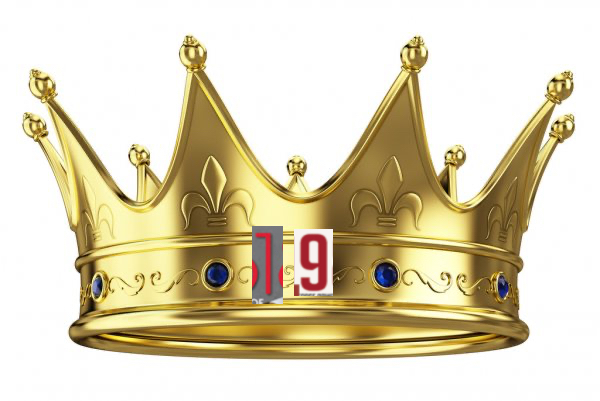

# Название
«Разведчик с большой буквы. Ч.2»

## Сложность:
25

## Условие
> В заданиях этой серии скрыты намеки.
> Как называли разведчика? Это было особое прозвище... Введи прозвище маленькими буквами через подчекривание.

## Ответ
`король_нелегалов`

## Решение
> На картинке изображена корона. Ищем разведчика и корону, находим Александра Короткова и его прозвище **Король нелегалов**
