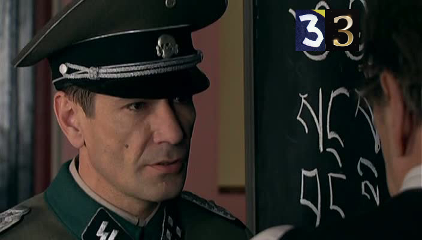

# Название
«Разведчик с большой буквы. Ч.5»

## Сложность:
25

## Условие
> В заданиях этой серии скрыты намеки.
> Он восстановил с ними связь. Как называлась эта организация? Про нее даже снимали сериал.

## Ответ
`Красная_Капелла`

## Решение
> Ищем в гугле по картинке - название сериала Красная Капела. Ищем ее - действительно она ведет нас к Короткову
