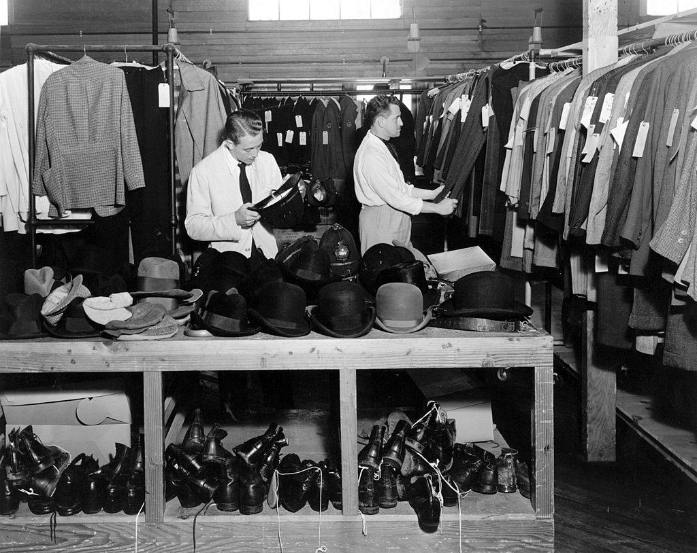

# Название
«Тяжкая ноша. Ч.3»

## Сложность:
100

## Условие
> Первое место работы в этой стране было весьма заурядным. Послушай аудио и посмотри на фото. Что это за место?

## Прикрепить
`3.mp3` `3.jpg`

## Ответ
`химчистка`

## Решение
> Фото + звук стиральной машины наталкивают на мысль о химчистке. Проверяем место работы в Дании. Бинго!
