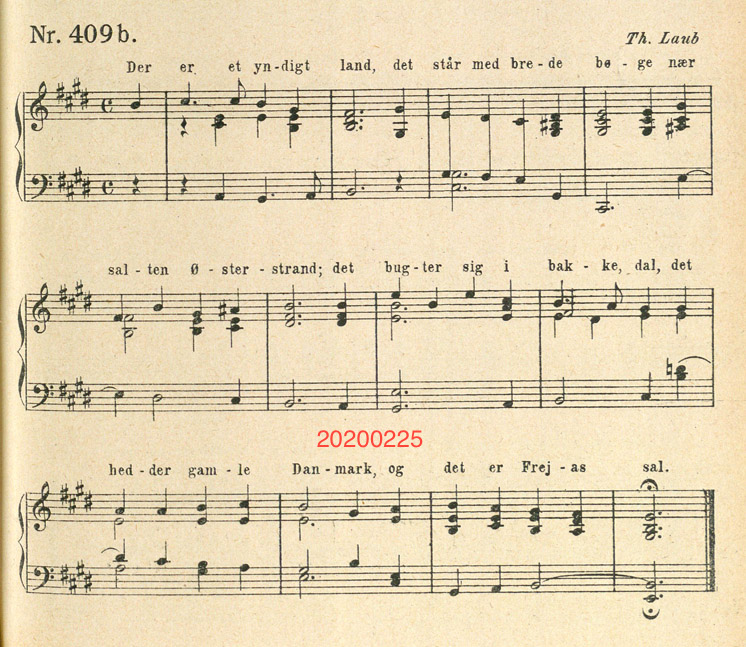

# Название
«Тяжкая ноша. Ч.2»

## Сложность:
25

## Условие
> Он работал там, когда только начал деятельность разведчика в 1962 году. Кажется фотография может подсказать

## Ответ
`Дания`

## Решение
> Смотрим на ноты. Видим текст. После того как загуглим `Der er et yndigt land` получаем `Denmark national anthem` т.е. Дания
